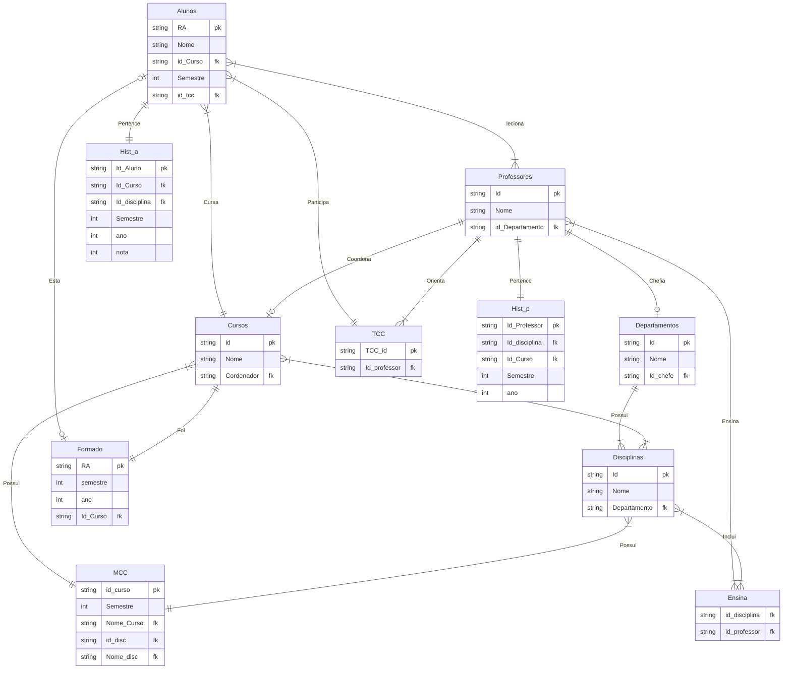

# ProjetoDB
### Integrantes:  
- Fernando Milani Venerando RA: 24.122.063-1 
- Lucas Rezende Simões RA: 24.122.028-4 
- Murilo Darce Borges Silva RA: 24.122.031-8

# Como utilizar o código
# Diagrama Relacional

