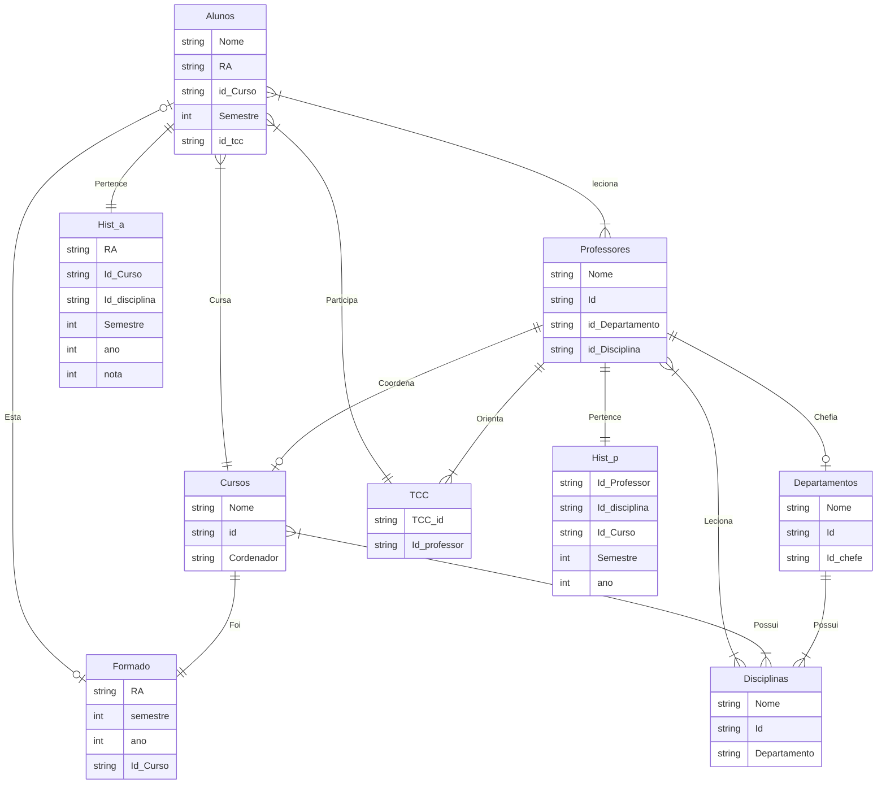

```mermaid
erDiagram
    Alunos {
        string Nome
        string RA
        string id_Curso
        int Semestre
        string id_tcc
    }
    Professores {
        string Nome
        string Id
        string id_Departamento
        string id_Disciplina
    }
    Cursos {
        string Nome
        string id
        string Cordenador
    }
    Departamentos {
        string Nome
        string Id
        string Id_chefe
    }
    Disciplinas {
        string Nome
        string Id
        string Departamento
    }
    TCC {
        string TCC_id
        string Id_professor
    }
    Hist_a {
        string RA
        string Id_Curso
        string Id_disciplina
        int Semestre
        int ano
        int nota
    }
    Hist_p {
        string Id_Professor
        string Id_disciplina
        string Id_Curso
        int Semestre
        int ano
    }
    Formado{
       string RA
        int semestre
        int ano
        string Id_Curso
    }

    Alunos }|--|{ Professores : leciona
    Alunos }|--|| Cursos : Cursa
    Alunos }|--|| TCC : Participa
    Alunos ||--|| Hist_a : Pertence
    Alunos |o--o| Formado : Esta

    Professores ||--o| Cursos : Coordena
    Professores ||--o| Departamentos : Chefia
    Professores }|--|{ Disciplinas: Leciona
    Professores ||--|{ TCC : Orienta
    Professores ||--|| Hist_p : Pertence

    Cursos }|--|{ Disciplinas : Possui
    Cursos ||--|| Formado : Foi

    Departamentos ||--|{ Disciplinas : Possui
```
