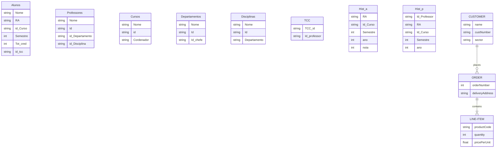

```mermaid
erDiagram
    Alunos {
        string Nome
        string RA
        string id_Curso
        int Semestre
        int Tot_cred
        string id_tcc
    }
    Professores {
        string Nome
        string Id
        string id_Departamento
        string id_Disciplina
    }
    Cursos {
        string Nome
        string id
        string Cordenador
    }
    Departamentos {
        string Nome
        string Id
        string Id_chefe
    }
    Disciplinas {
        string Nome
        string Id
        string Departamento
    }
    TCC {
        string TCC_id
        string Id_professor
    }
    Hist_a {
        string RA
        string Id_Curso
        int Semestre
        int ano
        int nota
    }
    Hist_p {
        string Id_Professor
        string RA
        string Id_Curso
        int Semestre
        int ano
    }

    CUSTOMER ||--o{ ORDER : places
    CUSTOMER {
        string name
        string custNumber
        string sector
    }
    ORDER ||--|{ LINE-ITEM : contains
    ORDER {
        int orderNumber
        string deliveryAddress
    }
    LINE-ITEM {
        string productCode
        int quantity
        float pricePerUnit
    }
```
