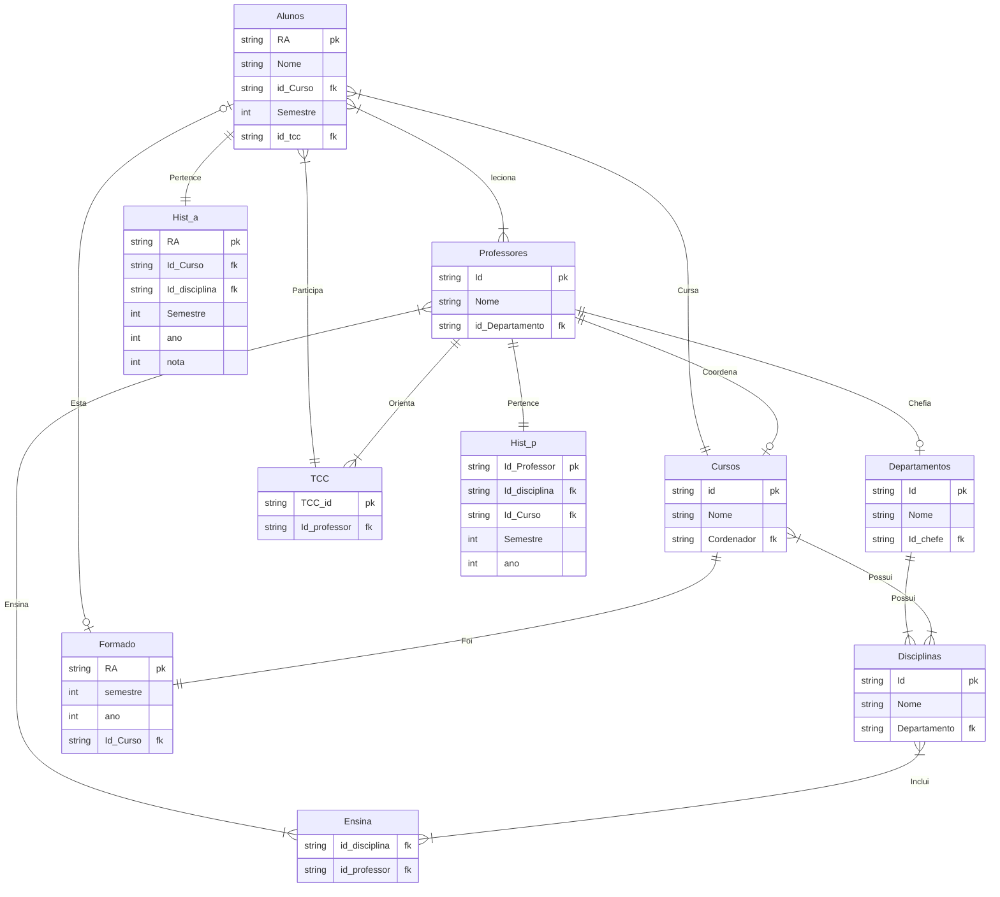

```mermaid
erDiagram
    Alunos {
        string RA pk
        string Nome
        string id_Curso fk
        int Semestre
        string id_tcc fk
    }
    Professores {
        string Id pk
        string Nome
        string id_Departamento fk
    }
    Cursos {
        string id pk
        string Nome
        string Cordenador fk
    }
    Departamentos {
        string Id pk
        string Nome
        string Id_chefe fk
    }
    Disciplinas {
        string Id pk
        string Nome
        string Departamento fk
    }
    TCC {
        string TCC_id pk
        string Id_professor fk
    }
    Hist_a {
        string RA pk
        string Id_Curso fk
        string Id_disciplina fk
        int Semestre
        int ano
        int nota
    }
    Hist_p {
        string Id_Professor pk
        string Id_disciplina fk
        string Id_Curso fk
        int Semestre
        int ano
    }
    Formado{
        string RA pk
        int semestre
        int ano
        string Id_Curso fk
    }
    Ensina{
        string id_disciplina fk
        string id_professor fk
        
    }

    Alunos }|--|{ Professores : leciona
    Alunos }|--|| Cursos : Cursa
    Alunos }|--|| TCC : Participa
    Alunos ||--|| Hist_a : Pertence
    Alunos |o--o| Formado : Esta

    Professores ||--o| Cursos : Coordena
    Professores ||--o| Departamentos : Chefia
    Professores ||--|{ TCC : Orienta
    Professores ||--|| Hist_p : Pertence
    Professores }|--|{ Ensina : Ensina

    
    Cursos ||--|| Formado : Foi

    Departamentos ||--|{ Disciplinas : Possui
    Cursos }|--|{ Disciplinas : Possui

    Disciplinas }|--|{ Ensina : Inclui
```
